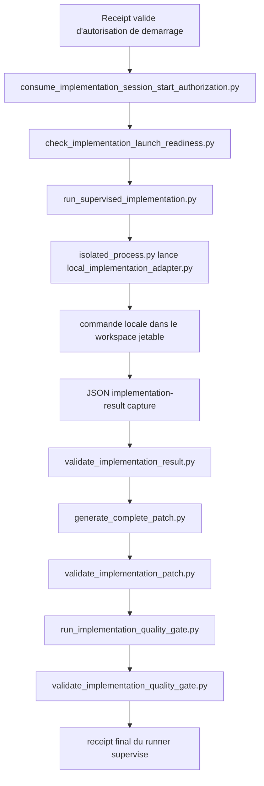

# Audit d'implementation du handoff

Source : `codex-handoff-workflow-agentique.md`  
Date d'audit initial : 2026-06-30  
Derniere mise a jour : 2026-07-02  
Perimetre : comparer le plan du handoff avec l'implementation presente dans le
depot.

Ce document est volontairement strict. Il explique ce qui existe reellement
dans le checkout, quel fichier porte chaque comportement, et ce qui manque
encore. Il ne considere jamais qu'un script, une fixture verte ou un rapport de
readiness vaut autorisation.

## Etat global

Le workflow decrit dans le handoff est partiellement implemente sous forme de
pilote local, supervise et non autorisant.

La brique la plus importante qui existe maintenant est un runner local minimal
de bout en bout : il consomme une autorisation de demarrage de session validee,
verifie la readiness de lancement, execute un adaptateur local borne dans un
workspace jetable, valide le resultat d'implementation capture, genere et
valide un patch, lance la quality gate hors ligne, valide le receipt de quality
gate, puis produit un receipt final.

Le pilote n'est pas encore une plateforme agentique autonome complete. Le
checker d'etat courant indique :

```text
agentic-workflow-status: INCOMPLETE
agent_invocation_authorized=false
publication_authorized=false
```

Le checker de readiness du runner indique :

```text
runner-readiness: NOT_READY
runner_selected=false
agent_invocation_authorized=false
```

Le checker global expose aussi `runner_unready_controls`, qui liste les
controles runner non satisfaits sans les convertir en autorisation ni en
readiness.

Raisons principales :

- le golden set historique n'est pas adopte ;
- la comparaison multi-adaptateur valide seulement des artefacts locaux deja
  captures et ne lance pas les adaptateurs ;
- l'isolation des credentials fournisseur dans les descendants, l'isolation
  reseau, le budget de tours modele et le cycle de vie complet du worktree
  jetable ne sont pas completement prouves ; l'environnement direct de
  l'adaptateur local filtre maintenant les variables de credentials provider,
  mais pas les credentials charges depuis fichiers ou credential stores ;
  l'allowlist d'outils du runner est maintenant prouvee localement mais ne
  couvre pas le comportement interne d'un provider ;
- l'orchestration GitHub Actions agentique n'a pas ete ajoutee, car les
  changements dans `.github/**` demandent une approbation humaine explicite ;
- l'outillage de publication existe seulement derriere une demande explicite et
  n'est pas autorise par les checks d'etat.

Corrections locales apportees apres l'audit initial :

- ajout du prompt portable `.agent/prompts/review.md` et du template
  `.agent/templates/review.md` ;
- ajout du prompt portable `.agent/prompts/compact-progress.md` ;
- extension du contrat d'artefacts pour `review.md` ;
- ajout des wrappers locaux `.agent/checks/fast.sh`,
  `.agent/checks/full.sh`, `.agent/checks/tests-policy.sh` et
  `.agent/checks/secret-scan.sh` ;
- ajout de `.agent/config.yaml` comme inventaire central non autorisant ;
- ajout des wrappers `.agent/scripts/validate-patch.sh` et
  `.agent/scripts/collect-metrics.sh` ;
- ajout des wrappers `.agent/scripts/prepare-task.sh`,
  `.agent/scripts/classify-task.sh`, `.agent/scripts/run-stage.sh` et
  `.agent/scripts/publish-draft-pr.sh` ;
- ajout du collecteur read-only `.agent/checks/fetch_github_issue_snapshot.py`
  et du wrapper `.agent/scripts/fetch-issue-snapshot.sh` pour produire le
  package externe attendu par l'approbation d'issue ;
- ajout de `.agent/checks/prepare_github_task.py` et des sous-commandes
  `fetch-check` / `approve-init` dans `.agent/scripts/prepare-task.sh` pour
  chainer fetch explicite, approbation exacte de snapshot et initialisation de
  portable run sans approuver la tache ;
- ajout des sous-commandes `task-check` / `task-approve` dans
  `.agent/scripts/prepare-task.sh`, qui deleguent directement a
  `.agent/checks/approve_task.py` sans changer la frontiere d'approbation ;
- ajout de `.agent/checks/list_github_approved_issues.py` et de
  `prepare-task.sh queue-list` pour produire une file read-only externe des
  issues ouvertes `agent:approved`, sans selection automatique ;
- bornage de la preuve `.agent/checks/prove_supervised_runner_execution.py` :
  elle utilise maintenant des fixtures explicites pour consommation,
  launch-readiness, patch et quality gate, afin que le ledger global reste
  executable sans rejouer toute la chaine d'autorisation ;
- ajout des wrappers adaptateurs optionnels `.agent/adapters/opencode.sh`,
  `.agent/adapters/aider.sh`, `.agent/adapters/claude-code.sh` et
  `.agent/adapters/mini-swe-agent.sh` ;
- alignement de `.agent/adapters/codex.sh` sur le meme contrat de wrapper local
  d'implementation ;
- ajout des schemas de compatibilite `.agent/schemas/result.schema.json`,
  `.agent/schemas/research.schema.json` et `.agent/schemas/plan.schema.json` ;
- ajout de l'adaptateur local read-only `.agent/adapters/local_read_only.py`,
  qui capture stdout, valide la reponse de stage et refuse les mutations Git
  visibles ;
- ajout de l'asset optionnel
  `.agents/skills/proparse-research/agents/proparse-researcher.yaml` ;
- ajout de `evals/golden-set.yaml` comme marqueur versionne du statut
  `not_adopted`, lie au checker de readiness golden-set sans transformer
  l'absence de corpus en readiness ;
- ajout de `runner_unready_controls` dans
  `.agent/checks/check_workflow_status.py`, pour exposer directement les
  controles runner encore non satisfaits, quel que soit leur niveau d'evidence
  diagnostique ;
- ajout d'une allowlist d'entrypoints d'adaptateur dans
  `.agent/checks/run_supervised_implementation.py`, d'une allowlist de
  commandes provider dans `.agent/adapters/local_implementation_adapter.py`, et
  de `.agent/checks/prove_runner_tool_allowlist.py` comme preuve bornee que le
  runner refuse un adaptateur non allowliste avant consommation de
  l'autorisation.
- le runner normalise maintenant l'entrypoint d'adaptateur vers le chemin absolu
  resolu apres validation allowlist, afin que la commande effectivement lancee
  reste couplee au fichier valide plutot qu'a un chemin relatif interprete
  depuis le worktree.
- extension de `.agent/checks/prove_supervised_runner_execution.py` pour
  observer, en fixture, le cleanup apres succes, le cleanup apres arret
  controle, et la retention du `cleanup-receipt` dans le receipt final, sans
  revendiquer le cleanup apres terminaison forcee, timeout non controle ou
  crash.
- extension du runner supervise pour tenter le cleanup exact sur les arrets
  controles apres consommation/launch readiness quand `--cleanup-receipt-output`
  est fourni, avec preuve fixture
  `cleanup_after_controlled_blocked_completion`; cela ne prouve pas le cleanup
  apres terminaison forcee, crash hote ou lifecycle global.
- validation du cleanup receipt par
  `.agent/checks/validate_disposable_worktree_cleanup.py` apres cleanup
  reussi dans le runner supervise, retenue comme evidence liee
  `cleanup_receipt_validation_after_runner_cleanup` sans authentifier
  l'historique ni prouver le cleanup apres crash.
- ajout de `.agent/checks/validate_supervised_runner_receipt.py` pour valider
  le `final-receipt.json` du runner supervise, ses bindings et les artefacts
  encore presents, sans authentifier le producteur historique du run.
- extension de la preuve fixture du runner supervise pour observer
  `final_receipt_valid=true` apres ecriture du receipt final dans un run bloque
  controle et dans un run fixture complet.
- extension de la preuve fixture du runner supervise pour observer l'ordre
  `consommation autorisation -> launch readiness -> adaptateur`, lie a
  `authorization_consumption_to_process_start` sans revendiquer d'atomicite
  crash-safe ni de prevention replay cross-host.
- filtrage de l'environnement enfant dans
  `.agent/adapters/local_implementation_adapter.py` et ajout de
  `.agent/checks/prove_local_adapter_environment_filter.py` comme preuve
  bornee que les variables provider synthetiques ne rejoignent pas la commande
  enfant directe de l'adaptateur ; cela reste une evidence liee, pas une preuve
  globale de non-inheritance des credentials fournisseur.
- alignement de la borne `.agent/checks/isolated_process.py` sur
  `adapter_timeout_seconds=600.0` du runner supervise, avec evidence liee dans
  `.agent/checks/assess_runner_readiness.py`; cela evite un rejet local avant
  lancement mais ne prouve pas un timeout de session complet ni le cleanup d'un
  arbre de processus arbitraire.
- extension de la preuve fixture du runner supervise pour observer qu'un
  timeout d'adaptateur deja capture bloque avant retention de `result.json`,
  avant generation du patch et avant quality gate, avec cleanup optionnel sur
  ce chemin controle ; cela reste une evidence liee et ne prouve pas le timeout
  complet de session, la terminaison forcee hors chemin capture, ni le cleanup
  apres crash.
- liaison du budget `max_turns=12` de
  `.agent/policies/implementation-session.json` au ledger runner comme
  evidence contractuelle liee pour `model_turn_budget`, sans pretendre que le
  runner mesure ou impose les tours consommes par un fournisseur.
- liaison du contrat runner `network_requested=false` et
  `publication_requested=false` comme evidence contractuelle liee pour
  `network_isolation`, sans preuve OS-level, sandbox provider, ni denial reseau
  d'un adaptateur live.
- ajout de `.agent/checks/build_runner_metrics_observation.py` pour deriver une
  observation de metriques depuis un `final-receipt.json` de runner supervise
  valide ; les timestamps et l'identite modele restent fournis explicitement,
  les tokens/couts restent `unavailable`, et le record canonique reste produit
  par `.agent/checks/record_run_metrics.py`.
- liaison de la contrainte runner `workspace`/sorties externes comme evidence
  contractuelle liee pour `filesystem_write_scope`, sans preuve de sandbox
  filesystem ni blocage des ecritures absolues arbitraires d'un processus
  enfant.

## Flux reel du runner



Fichiers cles :

- `.agent/checks/run_supervised_implementation.py` : orchestrateur du runner
  supervise de bout en bout.
- `.agent/adapters/local_implementation_adapter.py` : wrapper de commande
  locale qui emet le contrat portable `implementation-result`.
- `.agent/checks/build_supervised_runner_invocation.py` : helper qui construit
  la ligne de commande exacte du runner a partir d'artefacts deja valides.
- `.agent/checks/prove_supervised_runner_execution.py` : preuve par fixture
  bornee que le coeur du runner impose la validation post-capture avant de
  conserver un resultat, un patch ou une sortie de quality gate ; ses entrees
  de consommation, launch-readiness, patch et quality gate sont des fixtures et
  non des preuves de la chaine reelle complete.
- `.agent/policies/supervised-implementation-runner.json` : policy fixe du
  runner.
- `docs/agent-guides/supervised-runner-workflow.md` : tutoriel et guide
  d'utilisation du runner local.

## Section 1 - Objectif

### 1.1 Vision generale

Intention du handoff : construire un workflow economique, portable,
progressivement autonome, supervise par un humain, et capable d'utiliser
plusieurs harnesses et modeles.

Realite implementee : partielle. Le depot contient maintenant un framework
portable de preuves locales sous `.agent/`, beaucoup de validateurs
deterministes, des prompts portables, des skills locales au repo et un runner
local supervise. L'implementation reste locale et mono-execution. Elle n'est
pas continue, pas independante d'un fournisseur au runtime, et pas encore une
plateforme multi-harness complete.

Fichiers :

- `.agent/checks/check_workflow_status.py`
- `.agent/policies/workflow-status.json`
- `docs/agent-guides/workflow-status.md`
- `.agent/checks/run_supervised_implementation.py`
- `.agent/adapters/local_implementation_adapter.py`

Precision : le statut global inclut maintenant un champ
`runner_unready_controls` derive de `.agent/checks/assess_runner_readiness.py`,
pour rendre visibles les controles runner non satisfaits.

Ecart : le changement dynamique d'adaptateur entre Codex, OpenCode, Aider et
Claude Code n'est pas implemente comme selection automatique de runner. Le
depot fournit maintenant des wrappers optionnels alignes sur l'adaptateur local,
mais leur execution reelle depend encore des CLIs installees et d'une session
autorisee.

### 1.2 Problemes a resoudre

Intention du handoff : traiter les agents peu fiables, la saturation du
contexte, la prompt injection, la sur-automatisation dangereuse, le verrouillage
fournisseur, le cout et les specificites ABL/IntelliJ.

Realite implementee : la plupart de ces sujets sont couverts par des
garde-fous, mais pas completement resolus au runtime.

- Agents peu fiables : la diff policy, la validation de patch, la validation du
  receipt de quality gate et la validation de sortie runner existent.
- Saturation du contexte : les artefacts portables, les prompts compacts et les
  frontieres read-only manuelles existent.
- Prompt injection : l'ingestion d'issue et l'approbation de tache gardent le
  texte source non fiable hors des sections de tache normalisees.
- Automatisation dangereuse : les rapports d'etat gardent les champs
  invocation, reseau, publication, merge et autorisation a `false`, sauf preuve
  locale exacte contraire.
- Verrouillage fournisseur : les contrats d'adaptateur sont documentes et les
  wrappers Codex/OpenCode/Aider/Claude/mini-swe partagent le meme protocole
  local ; le wrapper de commande locale reste le protocole canonique teste, et
  l'execution provider reelle n'est pas prouvee.
- Cout : les budgets sont representes dans les contrats de session et de
  preflight, mais la telemetrie cout fournisseur est manuelle et non imposee.
- Specificite ABL : le skill `proparse-research` et les regles AGENTS sont
  presents.

Fichiers :

- `.agent/checks/diff_policy.py`
- `.agent/checks/validate_implementation_result.py`
- `.agent/checks/validate_implementation_patch.py`
- `.agent/checks/run_implementation_quality_gate.py`
- `.agent/checks/validate_implementation_quality_gate.py`
- `.agent/checks/approve_github_issue_snapshot.py`
- `.agent/checks/record_run_metrics.py`
- `.agents/skills/proparse-research/SKILL.md`

Ecart : l'isolation reseau au runtime et la non-inheritance des credentials
fournisseur par les descendants ne sont explicitement pas prouvees.

### 1.3 Resultat final attendu

Flux vise par le handoff : issue approuvee -> normalisation de tache ->
recherche read-only -> plan -> gates humaines -> implementation isolee ->
validation deterministe -> PR brouillon -> CI -> review humaine -> merge
manuel.

Realite implementee : les couches centrales et la validation locale sont les
plus solides. La file GitHub complete, les workflows CI agentiques et le
pipeline de publication ne sont pas implementes. Le checkout contient en
revanche deja une CI quality-gate non agentique sous
`.github/workflows/quality-gate.yml`.

Implemente :

- contrats d'artefacts portables pour run, task, research, plan et stage ;
- adaptateurs read-only manuel et local pour repeter recherche, plan et review ;
- contrats de session d'implementation, approbation, preflight, demarrage,
  consommation et readiness de lancement ;
- outils de preparation, validation et nettoyage du worktree jetable ;
- runner local supervise d'implementation avec validation de receipt final ;
- validation de resultat, patch, receipt de patch, quality gate et receipt de
  quality gate ;
- publisher deterministe de draft PR, seulement sur demande explicite.

Manquant ou partiel :

- file d'issues GitHub automatique par labels ;
- workflows GitHub Actions agentiques de build/publication ;
- boucle continue live ;
- creation automatique de draft PR sans demande explicite ;
- golden set historique adopte.

Fichiers :

- `.agent/checks/initialize_portable_run.py`
- `.agent/checks/approve_task.py`
- `.agent/checks/validate_task_approval.py`
- `.agent/checks/build_stage_context.py`
- `.agent/adapters/manual_read_only.py`
- `.agent/adapters/local_read_only.py`
- `.agent/checks/apply_stage_output.py`
- `.agent/checks/validate_stage_application.py`
- `.agent/checks/build_implementation_handoff.py`
- `.agent/checks/authorize_implementation_session_start.py`
- `.agent/checks/consume_implementation_session_start_authorization.py`
- `.agent/checks/prepare_disposable_worktree.py`
- `.agent/checks/validate_disposable_worktree.py`
- `.agent/checks/run_supervised_implementation.py`
- `.agent/checks/validate_supervised_runner_receipt.py`
- `.agent/checks/publish_draft_pr.py`

### 1.4 Criteres de reussite

Etat par critere :

| Critere | Etat actuel | Preuve |
| --- | --- | --- |
| Les taches deterministes sont scriptes quand possible | Implemente localement | `.agent/checks/*.py`, policies, tests |
| L'agent n'a pas de token GitHub en ecriture | Impose par conception dans le runner local seulement | les policies runner/adaptateur gardent publication/reseau a false |
| L'agent ne peut pas merger ni publier une release | Implemente localement | aucun chemin merge/release dans le runner ; publisher separe |
| PR brouillon uniquement | Partiel | `.agent/checks/publish_draft_pr.py`, demande explicite seulement |
| Fichiers sensibles bloques ou approbation humaine requise | Partiel | `.agent/checks/diff_policy.py`, regles AGENTS ; CI existante conservee, aucun workflow agentique ajoute |
| Artefacts task/research/plan/progress/verification/patch reproductibles | Partiel | artefacts portables presents ; pas de run complet issue->PR live |
| Contexte compacte entre phases | Manuel/base artefacts | templates et prompts presents |
| Travail ABL inspecte RSSW/Proparse | Implemente comme regle/skill | `.agents/skills/proparse-research/` |
| ktlint/detekt/tests/verifyPlugin obligatoires | Script implemente, controle runner encore partiel | `.agent/checks/run_implementation_quality_gate.py` existe ; `implementation_quality_gate_execution` reste une evidence liee dans `.agent/checks/assess_runner_readiness.py` tant qu'aucun receipt concret valide ne prouve l'execution |
| Au moins cinq issues historiques en golden set | Non implemente | `evals/golden-set.yaml` marque `not_adopted` et readiness golden-set reste false |
| Metriques par execution | Partiel | observation derivable d'un receipt runner valide, record canonique par `.agent/checks/record_run_metrics.py`, cout/tokens toujours non authentifies |
| Meme contrat adaptateur pour Codex/OpenCode/autre | Partiel | wrappers optionnels structurellement testes ; execution provider non prouvee |

## Section 2 - Besoins et contraintes

### 2.1 Fonctionnalites attendues

Etat : mixte, avec un noyau local implemente et des capacites live encore
partielles.

Elements obligatoires pour la premiere version :

| Element | Etat actuel | Notes |
| --- | --- | --- |
| Recuperer une issue GitHub approuvee | Partiel | `list_github_approved_issues.py` liste la file et `fetch_github_issue_snapshot.py` recupere une issue explicite ; pas de loop live |
| Normaliser l'issue en tache compacte | Implemente localement | outils portable run et approbation de tache |
| Separer research, plan, implement, review | Partiel | stages read-only `research`/`plan`/`review`, adaptateurs manuel et local read-only, et runner implementation existent ; pas de provider live prouve |
| Produire un patch Git, pas des edits directs sur main | Implemente localement | `.agent/checks/generate_complete_patch.py`, `.agent/checks/validate_implementation_patch.py` |
| Checks deterministes de patch | Implemente | diff policy, validation patch, quality gate |
| Refuser les modifications interdites | Implemente pour la policy de patch | `.agent/checks/diff_policy.py` |
| Creer branche et PR brouillon via composant deterministe | Partiel | `publish_draft_pr.py`, non autorise par status et pas de workflow agentique de publication |
| Mesurer chaque run | Partiel | observation derivable d'un receipt runner valide et record canonique ; cout/tokens restent non authentifies |
| Tester plusieurs adaptateurs | Partiel | comparaison locale d'artefacts captures seulement |
| Skill portable `proparse-research` | Implemente | `.agents/skills/proparse-research/` |

Les elements de moyen terme et optionnels ne sont majoritairement pas
implementes. Il n'y a pas de boucle continue sur une issue unique, pas de runner
benchmark live multi-fournisseur, pas de mode PR automatique faible risque, et
pas d'extraction C#/web.

Ecart global : les fonctionnalites de premiere version existent surtout comme
outils locaux composables ; elles ne forment pas encore un service continu ni
une chaine issue GitHub -> PR autonome.

### 2.2 Contraintes techniques

Etat : partiel mais correctement borne par les guides locaux.

Implemente correctement :

- l'audit de repository existe et enregistre des faits verifies du projet ;
- les regles AGENTS fixent les frontieres d'architecture Kotlin/IntelliJ/RSSW ;
- les commandes de quality gate sont documentees et utilisees par la quality
  gate d'implementation ;
- l'usage de Proparse/RSSW est garde par un skill dedie.

Fichiers :

- `docs/agent-guides/repository-audit.md`
- `AGENTS.md`
- `.agents/skills/proparse-research/references/known-entry-points.md`
- `.agent/checks/run_implementation_quality_gate.py`

Ecart : la branch protection et les reglages remote restent unverifiables
depuis le checkout.

### 2.3 Contraintes budgetaires

Realite implementee : les champs de budget existent dans les contrats de
proposition/preflight. Les metriques peuvent etre enregistrees depuis une
observation explicite, ou derivees partiellement d'un receipt final de runner
supervise valide pour l'identite, l'issue, le commit de base, l'outcome et le
patch SHA-256. Les timestamps et l'identite modele restent fournis par
l'operateur ; les tokens et couts restent `unavailable` sauf observation
externe explicite.

Fichiers :

- `.agent/checks/build_implementation_session.py`
- `.agent/checks/build_implementation_invocation_preflight.py`
- `.agent/checks/record_run_metrics.py`
- `.agent/checks/build_runner_metrics_observation.py`
- `.agent/policies/run-metrics.json`
- `.agent/policies/runner-metrics-observation.json`

Ecart : pas d'authentification de facturation fournisseur, pas de plafond dur
de cout, pas d'enforcement du budget de tours modele. La readiness runner
rapporte maintenant `model_turn_budget: related_evidence_only`, car le budget
`max_turns=12` est declare dans le contrat de session mais n'est pas impose par
un provider ou mesure par le runner.

### 2.4 Contraintes humaines

Realite implementee : plusieurs gates humaines sont modelisees par des receipts
locaux exacts et des validations, mais elles n'authentifient pas l'humain. Le
workflow separe les gates humaines de la readiness. Le golden set dispose d'un
receipt d'adoption local via `approve_golden_set.py`, mais pas encore d'un
validateur independant dedie du receipt d'adoption ; la readiness historique
reste donc bloquee par `human_golden_set_adoption_decision`.

Fichiers :

- `.agent/checks/approve_task.py`
- `.agent/checks/validate_task_approval.py`
- `.agent/checks/approve_plan.py`
- `.agent/checks/validate_plan_approval.py`
- `.agent/checks/approve_implementation_session.py`
- `.agent/checks/validate_implementation_session_approval.py`
- `.agent/checks/authorize_implementation_session_start.py`
- `.agent/checks/validate_implementation_session_start_authorization.py`
- `.agent/checks/approve_golden_set.py`

Ecart : pas d'interface integree ni de workflow GitHub par labels pour la
review humaine.

### 2.5 Contraintes de securite

Realite implementee : de fortes frontieres de policy locales existent. Le
runner ne demande ni reseau ni publication. Le publisher est separe et
accessible seulement sur demande explicite. Le contenu d'issue non fiable est
normalise via approbation d'un snapshot exact.

Fichiers :

- `.agent/checks/isolated_process.py`
- `.agent/checks/prove_parent_environment_isolation.py`
- `.agent/checks/prove_local_adapter_environment_filter.py`
- `.agent/checks/assess_runner_readiness.py`
- `.agent/checks/approve_github_issue_snapshot.py`
- `.agent/checks/check_draft_pr_publication_readiness.py`
- `.agent/checks/publish_draft_pr.py`
- `.agent/policies/parent-environment-isolation.json`
- `.agent/policies/local-adapter-environment-filter-proof.json`
- `.agent/policies/runner-readiness.json`
- `.agent/policies/supervised-implementation-runner.json`

Ecarts :

- les credentials fournisseur peuvent encore atteindre les descendants dans
  une vraie frontiere agent ;
- l'isolation reseau n'est pas prouvee ; le contrat runner declare seulement
  qu'il ne demande ni reseau ni publication ;
- aucun workflow agentique `.github/**` n'a ete ajoute ;
- aucun sandbox OS-level n'est revendique.

### 2.6 Preferences exprimees

Realite implementee : le depot suit la preference pour les checks
deterministes, les skills portables, les gates human-in-the-loop, et la mesure
avant l'ajout d'une infrastructure lourde.

Fichiers :

- `.agent/checks/check_workflow_status.py`
- `.agents/skills/agentic-workflow-pilot/SKILL.md`
- `.agents/skills/proparse-research/SKILL.md`
- `.agent/checks/record_run_metrics.py`

Ecart : la portabilite entre agents est contractuelle plutot que prouvee par
des adaptateurs live.

### 2.7 Elements exclus ou differes

Realite implementee : les exclusions sont respectees. Il n'y a pas d'auto-merge,
pas de publication automatique de release, pas de modification autonome de CI,
pas de modification Gradle, pas d'acces GitHub en ecriture directement donne au
LLM, pas d'integration MCP externe, et pas de boucle continue multi-issues.

Fichiers qui l'imposent ou le documentent :

- `AGENTS.md`
- `docs/agent-guides/workflow-status.md`
- `.agent/checks/check_workflow_status.py`
- `.agent/policies/workflow-status.json`

## Section 3 - Workflow agentique envisage

### 3.1 Vue d'ensemble

Le flux 0 a 12 prevu n'est pas totalement implemente comme pipeline orchestre
unique. Il est implemente sous forme de gates locales composables, plus un
runner d'implementation supervise pour le segment implementation.

Realite implementee :

- Etapes 0-5 : surtout du scaffolding local d'artefacts, d'approbations et de
  stages read-only.
- Etape 6 : implementee comme runner local supervise minimal.
- Etape 7 : documentee via templates de progression, sans compaction
  automatique.
- Etape 8 : implementee comme validation patch et quality gate.
- Etape 9 : implementee comme stage read-only local et validation
  deterministe de `review.md`, pas comme review LLM/provider live.
- Etape 10 : publisher deterministe present, demande explicite seulement.
- Etapes 11-12 : laissees a la CI GitHub existante et aux humains.

Fichiers de preuve :

- `.agent/checks/check_workflow_status.py`
- `.agent/checks/assess_runner_readiness.py`
- `.agent/checks/run_supervised_implementation.py`

Ecart : cette vue d'ensemble reste une orchestration documentaire. Aucun
dispatcher unique ne selectionne automatiquement l'issue, le runner, les stages
ou la publication.

### 3.2 Parcours A/B/C

Realite implementee : la classification de risque existe pour les patchs et les
plans. `.agent/checks/classify_task_route.py`, expose aussi par
`.agent/scripts/classify-task.sh`, lit le `risk` declare dans `task.md` apres
validation du run portable et le mappe vers A/B/C. Il rapporte le statut de
tache courant mais ne prouve pas que le risque declare est correct. Le workflow
ne choisit toujours pas automatiquement le parcours depuis une issue GitHub
live.

Fichiers :

- `.agent/checks/classify_patch_risk.py`
- `.agent/checks/classify_task_route.py`
- `.agent/checks/diff_policy.py`
- `.agent/scripts/classify-task.sh`
- `docs/agent-guides/risk-classification.md`

Ecart : pas de routeur end-to-end qui part des labels GitHub pour choisir le
parcours A/B/C.

### 3.3 Etape 0 - file d'attente GitHub

Realite implementee : une file read-only peut etre listee par
`gh issue list --label agent:approved` sur le depot fixe par
`.agent/policies/github-approved-issue-queue.json`. Les labels observes et
l'etat distant restent non authentifies par le checkout local
(`github_label_independently_verified=false`,
`source_state_authenticated=false`). Il existe aussi un collecteur read-only par
`gh issue view` pour une issue explicite et un outil d'approbation de snapshot
manuel. La preparation locale chaine ensuite fetch explicite,
approbation exacte du snapshot, initialisation du portable run et approbation
de tache via sous-commandes explicites, mais pas de processeur pilote continu
par labels.

Fichiers :

- `.agent/checks/list_github_approved_issues.py`
- `.agent/policies/github-approved-issue-queue.json`
- `.agent/checks/fetch_github_issue_snapshot.py`
- `.agent/policies/github-issue-snapshot-fetch.json`
- `.agent/checks/approve_github_issue_snapshot.py`
- `.agent/checks/prepare_github_task.py`
- `.agent/policies/prepare-github-task.json`
- `.agent/scripts/fetch-issue-snapshot.sh`
- `.agent/scripts/prepare-task.sh`
- `docs/agent-guides/github-issue-ingestion.md`

Ecart : aucun script deterministe ne surveille en continu une file d'issues
`agent:approved` ni ne selectionne automatiquement la prochaine issue. Le
collecteur de snapshot exige encore un numero d'issue explicite et une
normalisation humaine externe.

### 3.4 Etape 1 - preparation et normalisation de la tache

Realite implementee : implemente sous forme de fetch read-only optionnel,
d'approbation exacte de snapshot, d'initialisation locale de portable run et
d'approbation exacte de tache. Le wrapper `.agent/scripts/prepare-task.sh`
supporte maintenant `fetch-check` puis `approve-init` pour chainer une issue
GitHub explicite jusqu'a l'initialisation du run, avec confirmation exacte du
snapshot. Il expose aussi `queue-list` pour inspecter la file approuvee et
`task-check` / `task-approve`, qui deleguent a
`approve_task.py` pour la decision locale exacte d'approbation de tache.

Fichiers :

- `.agent/checks/prepare_github_task.py`
- `.agent/policies/prepare-github-task.json`
- `.agent/checks/fetch_github_issue_snapshot.py`
- `.agent/checks/approve_github_issue_snapshot.py`
- `.agent/checks/initialize_portable_run.py`
- `.agent/checks/validate_portable_run_initialization.py`
- `.agent/checks/approve_task.py`
- `.agent/checks/validate_task_approval.py`
- `.agent/templates/task.md`
- `.agent/scripts/fetch-issue-snapshot.sh`
- `.agent/scripts/prepare-task.sh`

Ecart : `prepare-task.sh` ne selectionne pas automatiquement la prochaine issue
GitHub et n'approuve jamais automatiquement la tache. Il exige toujours une
normalisation humaine externe et des confirmations exactes avant d'ecrire le
normalized input, le run ou le receipt d'approbation de tache.

### 3.5 Etape 2 - classification du risque

Realite implementee : la classification de risque de patch et la diff policy
existent. Le routage de risque de tache est represente dans les artefacts et
`.agent/checks/classify_task_route.py` peut en extraire la route A/B/C depuis
un run portable valide, mais ce n'est pas un stage de file GitHub live et cela
n'approuve pas la tache.

Fichiers :

- `.agent/checks/classify_patch_risk.py`
- `.agent/checks/classify_task_route.py`
- `.agent/policies/risk-rules.json`
- `.agent/policies/task-risk-route.json`
- `.agent/scripts/classify-task.sh`
- `docs/agent-guides/risk-classification.md`

Ecart : la classification calcule une route locale depuis des artefacts ; elle
ne prouve pas que la declaration de risque initiale est juste et ne remplace
pas une revue humaine.

### 3.6 Etape 3 - recherche read-only

Realite implementee : le scaffolding de stage read-only existe, avec prompts,
builder de contexte, validateur de sortie, adaptateur manuel, adaptateur local
de commande read-only et receipt d'application. L'adaptateur local refuse les
mutations Git visibles, y compris quand la commande echoue ou depasse son
timeout ; c'est une detection, pas un rollback.

Fichiers :

- `.agent/prompts/research.md`
- `.agent/checks/build_stage_context.py`
- `.agent/checks/validate_stage_output.py`
- `.agent/adapters/manual_read_only.py`
- `.agent/checks/apply_stage_output.py`
- `.agent/checks/check_research_readiness.py`
- `.agent/adapters/local_read_only.py`
- `.agent/policies/local-read-only-adapter.json`
- `.agent/checks/tests/test_local_read_only_adapter.py`
- `docs/agent-guides/local-read-only-adapter.md`
- `.agents/skills/proparse-research/SKILL.md`

Ecart : l'adaptateur local read-only peut lancer une commande explicite et
valider stdout, mais il ne prouve pas encore sandbox fournisseur, isolation
reseau ou compatibilite reelle d'un provider CLI.

### 3.7 Etape 4 - validation humaine de la recherche

Realite implementee : la validation humaine de la recherche est representee par
une application de sortie acceptee avec confirmation exacte de l'operateur, puis
par une validation current-state du receipt d'application. Ce n'est pas une
approbation de recherche : `apply_stage_output.py` et
`validate_stage_application.py` conservent `authorized=false`, n'authentifient
pas l'humain et ne sont pas integres a l'UI de review GitHub.

Fichiers :

- `.agent/checks/approve_task.py`
- `.agent/checks/check_research_readiness.py`
- `.agent/checks/apply_stage_output.py`
- `.agent/checks/validate_stage_application.py`

Ecart : aucune approbation de recherche authentifiee n'existe ; l'application
de stage reste un acte local current-state non autorisant.

### 3.8 Etape 5 - planification read-only

Realite implementee : meme mecanique de stage read-only que pour la recherche,
plus approbation exacte du plan.

Fichiers :

- `.agent/prompts/plan.md`
- `.agent/templates/plan.md`
- `.agent/checks/build_stage_context.py`
- `.agent/checks/validate_stage_output.py`
- `.agent/adapters/local_read_only.py`
- `.agent/checks/apply_stage_output.py`
- `.agent/checks/approve_plan.py`
- `.agent/checks/validate_plan_approval.py`

Correction : l'adaptateur local read-only couvre aussi le stage `plan`.
Ecart restant : aucune preuve d'execution provider reelle ni de qualite du plan.

### 3.9 Etape 6 - implementation isolee

Realite implementee : c'est la partie la mieux implementee du pilote actuel. Le
runner supervise est local, borne, base sur des receipts, et valide les sorties
avant de continuer. Il passe par `.agent/checks/isolated_process.py`, normalise l'entrypoint
d'adaptateur allowliste avant execution, valide le resultat capture avant
retention, valide le patch avant quality gate, valide le receipt de quality
gate, puis valide son receipt final. Le cleanup du worktree est tente sur les
chemins controles quand l'output de cleanup est fourni, avec validation du
receipt de cleanup.

Fichiers :

- `.agent/checks/run_supervised_implementation.py`
- `.agent/checks/isolated_process.py`
- `.agent/adapters/local_implementation_adapter.py`
- `.agent/checks/build_supervised_runner_invocation.py`
- `.agent/checks/check_implementation_launch_readiness.py`
- `.agent/checks/consume_implementation_session_start_authorization.py`
- `.agent/checks/validate_implementation_result.py`
- `.agent/checks/validate_implementation_patch.py`
- `.agent/checks/run_implementation_quality_gate.py`
- `.agent/checks/validate_implementation_quality_gate.py`
- `.agent/checks/cleanup_disposable_worktree.py`
- `.agent/checks/validate_disposable_worktree_cleanup.py`
- `.agent/checks/validate_supervised_runner_receipt.py`
- `.agent/checks/prove_supervised_runner_execution.py`
- `.agent/checks/prove_runner_tool_allowlist.py`
- `.agent/checks/prove_local_adapter_environment_filter.py`

Ecarts :

- pas de sandbox fournisseur reel prouve ;
- pas d'isolation reseau prouvee au niveau OS/provider, meme si le contrat du
  runner ne demande ni reseau ni publication ;
- pas d'enforcement du budget de tours modele, meme si le contrat de session
  declare `max_turns=12` ;
- wrappers optionnels OpenCode/Aider/Claude/mini-swe presents, mais pas de
  preuve que les CLIs sont installees, correctement flaggees ou executees.

### 3.10 Etape 7 - compaction intentionnelle frequente

Realite implementee : les templates et docs existent. Il n'y a pas de
compacteur automatique.

Fichiers :

- `.agent/templates/progress.md`
- `.agent/templates/verification.md`
- `.agent/prompts/compact-progress.md`
- `.agent/prompts/implementation/implement.md`
- `docs/agent-guides/supervised-runner-workflow.md`

### 3.11 Etape 8 - validation deterministe externe

Realite implementee : implemente avec des checks Python plutot qu'avec les noms
de scripts shell exacts proposes dans le handoff.

Fichiers :

- `.agent/checks/diff_policy.py`
- `.agent/checks/generate_complete_patch.py`
- `.agent/checks/validate_implementation_patch.py`
- `.agent/checks/run_implementation_quality_gate.py`
- `.agent/checks/validate_implementation_quality_gate.py`
- `.agent/checks/check_workflow_status.py`

Correction : les wrappers nommes `.agent/checks/fast.sh`,
`.agent/checks/full.sh`, `.agent/checks/tests-policy.sh` et
`.agent/checks/secret-scan.sh` sont maintenant presents. Les wrappers de policy
deleguent a `.agent/checks/diff_policy.py`, qui porte deja les regles de tests affaiblis et
de signatures de secrets. Le secret scanning reste une detection locale de
signatures haute confiance, pas une integration Gitleaks.

### 3.12 Etape 9 - review LLM consultative optionnelle

Realite implementee : un prompt et un artefact de review read-only existent
maintenant, et l'adaptateur local read-only peut capturer puis valider une
reponse `review.md` produite par une commande explicite. Cette reponse peut
ensuite etre copiee dans le run par l'application de stage avec confirmation
exacte et receipt local, sans approuver le patch.

Fichiers :

- `.agent/checks/build_stage_context.py`
- `.agent/checks/validate_stage_output.py`
- `.agent/templates/verification.md`
- `.agent/prompts/review.md`
- `.agent/templates/review.md`
- `.agent/adapters/local_read_only.py`
- `.agent/policies/local-read-only-adapter.json`
- `.agent/checks/apply_stage_output.py`
- `.agent/checks/validate_stage_application.py`
- `.agent/checks/tests/test_local_read_only_adapter.py`

Ecart : la review reste consultative ; l'adaptateur local ne prouve pas
l'isolation fournisseur, la qualite de la review, ni une invocation provider
reelle.

### 3.13 Etape 10 - publication deterministe de la PR

Realite implementee : le publisher deterministe local existe et est teste, mais
il est accessible seulement sur demande explicite et n'est pas connecte a
GitHub Actions. Il est en dry-run par defaut ; `--execute` represente une
demande humaine explicite pouvant lancer `git push` puis `gh pr create --draft`,
sans que le status check autorise la publication.

Fichiers :

- `.agent/checks/publish_draft_pr.py`
- `.agent/scripts/publish-draft-pr.sh`
- `.agent/checks/check_draft_pr_publication_readiness.py`
- `.agent/policies/draft-pr-publisher.json`
- `.agent/policies/draft-pr-publication-readiness.json`
- `docs/agent-guides/draft-pr-publication-readiness.md`

Ecart : pas de `.github/workflows/publish-agent-pr.yml` ; pas
d'autorisation de publication issue des checks d'etat.

### 3.14 Etape 11 - CI, review humaine et merge manuel

Realite implementee : les informations sur la quality gate existante sont
documentees. Le workflow laisse volontairement CI, CODEOWNERS, branch
protection, review de PR et merge a GitHub et aux humains.

Fichiers :

- `docs/agent-guides/repository-audit.md`
- `AGENTS.md`
- `docs/agent-guides/implementation-quality-gate.md`
- `docs/agent-guides/draft-pr-publication-readiness.md`
- `.agent/checks/run_implementation_quality_gate.py`
- `.agent/checks/validate_implementation_quality_gate.py`
- `.agent/checks/check_draft_pr_publication_readiness.py`

Ecart : la branch protection ne peut pas etre verifiee localement.

## Section 4 - Agents

Le handoff decrit des agents nommes. Le depot implemente surtout leurs
responsabilites sous forme d'outils deterministes et de contrats locaux plutot
que comme agents live independants.

| Agent du handoff | Implementation actuelle | Etat |
| --- | --- | --- |
| Orchestrator deterministe | `check_workflow_status.py`, scripts runner/preflight/approval, inventaire `.agent/config.yaml` | Partiel ; pas d'orchestrateur continu unique |
| Normalizer deterministe | file read-only GitHub + fetch explicite + approbation de snapshot issue + portable run + approbation de tache via `prepare-task.sh` | Partiel ; pas de surveillance continue ni de selection automatique |
| Researcher generaliste | contrats de stage read-only, adaptateur manuel, adaptateur local read-only | Partiel ; pas de preuve provider live |
| Skill `proparse-research` | `.agents/skills/proparse-research/`, references et manifests `.agents/skills/proparse-research/agents/openai.yaml` / `.agents/skills/proparse-research/agents/proparse-researcher.yaml` | Implemente |
| Skill `agentic-workflow-pilot` | `.agents/skills/agentic-workflow-pilot/SKILL.md` et `.agents/skills/agentic-workflow-pilot/agents/openai.yaml` | Implemente |
| Sous-agent optionnel `proparse-researcher` | `.agents/skills/proparse-research/agents/proparse-researcher.yaml` | Implemente comme asset optionnel read-only |
| Planner | contrats read-only + adaptateur local read-only + approbation de plan | Partiel |
| Implementer | `run_supervised_implementation.py` + adaptateur local | Partiel ; runner local fonctionnel, controles runner encore incomplets |
| Reviewer LLM consultatif | prompt et artefact `review.md`, contexte `review`, validation de sortie et adaptateur local read-only testes | Partiel ; pas de provider reviewer live prouve |
| Validator deterministe | validateurs diff/patch/quality-gate | Implemente localement |
| Publisher deterministe | `publish_draft_pr.py` + `check_draft_pr_publication_readiness.py` | Partiel ; demande explicite seulement |
| Human owner | gates locales par receipts exacts | Partiel ; non authentifie |

## Section 5 - Architecture technique

### 5.1 Composants et technologies

Implemente :

- `.agent/` pour checks, policies, prompts, schemas et adaptateurs ;
- `.agents/skills/` pour les skills portables ;
- checks deterministes Python ;
- wrapper de quality gate Gradle ;
- outils de worktree jetable ;
- templates Markdown compacts ;
- adaptateur local de commande read-only ;
- wrappers optionnels pour OpenCode, Aider, Claude Code et mini-swe-agent.

Partiel ou manquant :

- orchestration GitHub Actions agentique ;
- execution prouvee de plusieurs adaptateurs fournisseur concrets ;
- Gitleaks/Renovate/Qodana/Semgrep/etc.

### 5.2 Flux de donnees

Realite implementee : le flux de donnees local existe depuis les artefacts
portables jusqu'au receipt d'implementation supervisee. Le flux complet issue
GitHub -> draft PR est incomplet.

Fichiers cles :

- `.agent/checks/initialize_portable_run.py`
- `.agent/checks/validate_portable_run_initialization.py`
- `.agent/checks/approve_task.py`
- `.agent/checks/validate_task_approval.py`
- `.agent/checks/build_stage_context.py`
- `.agent/checks/validate_stage_output.py`
- `.agent/checks/apply_stage_output.py`
- `.agent/checks/validate_stage_application.py`
- `.agent/checks/approve_plan.py`
- `.agent/checks/validate_plan_approval.py`
- `.agent/checks/build_implementation_handoff.py`
- `.agent/checks/build_implementation_session.py`
- `.agent/checks/validate_implementation_session.py`
- `.agent/checks/approve_implementation_session.py`
- `.agent/checks/validate_implementation_session_approval.py`
- `.agent/checks/build_implementation_invocation_preflight.py`
- `.agent/checks/validate_implementation_invocation_preflight.py`
- `.agent/checks/authorize_implementation_session_start.py`
- `.agent/checks/validate_implementation_session_start_authorization.py`
- `.agent/checks/consume_implementation_session_start_authorization.py`
- `.agent/checks/validate_implementation_session_start_consumption.py`
- `.agent/checks/check_implementation_launch_readiness.py`
- `.agent/checks/run_supervised_implementation.py`
- `.agent/checks/validate_supervised_runner_receipt.py`
- `.agent/checks/publish_draft_pr.py`

Ecart : ce flux de donnees local ne prouve pas la chaine externe complete
issue GitHub authentifiee -> runner provider live -> publication PR.

### 5.3 Orchestration

Realite implementee : l'orchestration est decentralisee entre petits checks
Python et le runner supervise. Le fichier central `.agent/config.yaml` existe
maintenant comme inventaire non autorisant ; il ne remplace pas les checks
canoniques. Les policies sont des fichiers JSON sous `.agent/policies/`. Les
checks canoniques produisent des bindings ou hashent les artefacts de policy
qu'ils consomment, et certains comparent une policy exacte ; ce n'est pas une
garantie uniforme que chaque checker lie les bytes exacts d'une policy attendue.

Fichiers :

- `.agent/policies/*.json`
- `.agent/config.yaml`
- `.agent/checks/check_workflow_status.py`
- `.agent/checks/run_supervised_implementation.py`
- `.agent/scripts/prepare-task.sh`
- `.agent/scripts/classify-task.sh`
- `.agent/scripts/run-stage.sh`
- `.agent/scripts/validate-patch.sh`
- `.agent/scripts/collect-metrics.sh`
- `.agent/scripts/publish-draft-pr.sh`
- `.agent/scripts/resolve-python.sh`

Correction : les wrappers `.agent/scripts/*.sh` existent maintenant comme
dispatchers locaux non autorisants vers les builders/validateurs existants.
Ecart restant : pas d'orchestrateur YAML central ni de loop continue qui
selectionne une issue, un runner ou un adaptateur.

### 5.4 Gestion du contexte et de la memoire

Realite implementee : les contrats d'artefacts et templates permettent un
contexte compact. La compaction automatique de session n'est pas implementee.

Fichiers :

- `.agent/templates/task.md`
- `.agent/templates/research.md`
- `.agent/templates/plan.md`
- `.agent/templates/progress.md`
- `.agent/templates/verification.md`
- `.agent/templates/review.md`
- `.agent/prompts/research.md`
- `.agent/prompts/plan.md`
- `.agent/prompts/review.md`
- `.agent/prompts/compact-progress.md`
- `.agent/prompts/implementation/implement.md`

Ecart : ces fichiers permettent une compaction disciplinee, mais aucune
compaction automatique de contexte ni retention longue duree n'est implementee.

### 5.5 Permissions et securite

Realite implementee : beaucoup de checks et policies locaux non autorisants
existent. `.agent/checks/diff_policy.py` protege les chemins sensibles dans les patchs
candidats. La policy runner garde reseau et publication a `false`.

Fichiers :

- `.agent/checks/diff_policy.py`
- `.agent/policies/diff-policy.json`
- `.agent/checks/assess_runner_readiness.py`
- `.agent/policies/runner-readiness.json`

Ecart : pas de preuve OS-level pour l'isolation reseau d'un vrai fournisseur.

### 5.6 GitHub Actions : separation des privileges

Realite implementee : le depot contient deja `.github/CODEOWNERS` et le
workflow CI `.github/workflows/quality-gate.yml`, qui execute la quality gate
Gradle existante. Aucun workflow agentique de build/publication n'a ete ajoute,
ce qui reste coherent avec la regle AGENTS actuelle qui exige une approbation
humaine explicite avant de modifier `.github/**`.

Fichiers locaux lies :

- `.github/CODEOWNERS`
- `.github/workflows/quality-gate.yml`
- `.agent/checks/check_draft_pr_publication_readiness.py`
- `.agent/checks/publish_draft_pr.py`

Ecart : pas de `.github/workflows/agent-build.yml` ni de
`.github/workflows/publish-agent-pr.yml`.

### 5.7 Structure de fichiers recommandee

Realite implementee : structure similaire, mais les checks Python remplacent
les scripts shell proposes et le repertoire `.agent/scripts/`.

Present :

- `.agent/adapters/`
- `.agent/checks/`
- `.agent/config.yaml`
- `.agent/policies/`
- `.agent/prompts/`
- `.agent/scripts/`
- `.agent/schemas/`
- `.agent/templates/`
- `.agents/skills/`
- `docs/agent-guides/`
- `evals/`

Corrige localement :

- checks shell exacts `fast.sh`, `full.sh`, `tests-policy.sh` et
  `secret-scan.sh`
- `.agent/scripts/validate-patch.sh`
- `.agent/scripts/collect-metrics.sh`
- `.agent/scripts/prepare-task.sh`
- `.agent/scripts/classify-task.sh`
- `.agent/scripts/run-stage.sh`
- `.agent/scripts/publish-draft-pr.sh`
- helper `.agent/scripts/resolve-python.sh` utilise par les wrappers shell
- wrappers adaptateurs optionnels `opencode.sh`, `aider.sh`,
  `claude-code.sh` et `mini-swe-agent.sh`
- test statique `.agent/checks/tests/test_optional_provider_wrappers.py`

Limite restante : ces wrappers prouvent seulement une forme commune de
delegation vers l'adaptateur local ; ils ne prouvent pas que les executables
fournisseur sont installes, correctement configures ou compatibles avec le
contrat de sortie attendu.

### 5.8 AGENTS.md initial propose

Realite implementee : `AGENTS.md` existe et est beaucoup plus complet que la
proposition initiale. Il contient le point d'entree vers la carte du depot,
toutes les frontieres des guides locaux, les contraintes d'architecture, les
garde-fous de changement et les commandes de qualite verifiees.

Fichier :

- `AGENTS.md`

Ecart : `AGENTS.md` encadre le travail local, mais ne fournit pas
d'authentification humaine, d'orchestration CI agentique ou de sandbox runtime.

### 5.9 Observabilite minimale

Realite implementee : les records de metriques existent et une observation peut
maintenant etre derivee d'un receipt final de runner supervise valide pour les
champs que ce receipt prouve. Il n'y a toujours pas de telemetrie automatique
fiable pour cout, tokens, fournisseur ou corrections humaines.

Fichiers :

- `.agent/checks/record_run_metrics.py`
- `.agent/checks/build_runner_metrics_observation.py`
- `.agent/policies/run-metrics.json`
- `.agent/policies/runner-metrics-observation.json`
- `docs/agent-guides/run-metrics.md`

Ecart : pas d'horodatage authentifie par le runner, pas de telemetrie
automatique fiable pour cout/tokens/fournisseur, et pas d'integration Langfuse
ou OpenTelemetry.

## Section 6 - Decisions prises

Les decisions majeures du handoff se retrouvent dans l'implementation :

- les scripts deterministes sont preferes au jugement LLM ;
- readiness, validation, approbation, autorisation, selection de runner,
  invocation et publication sont separees ;
- `.agent/` et `.agents/skills/` sont distincts ;
- la recherche Proparse est obligatoire avant les changements de langage ABL ;
- la publication GitHub est separee de l'implementation.

La ou l'implementation diverge :

- les checks Python a policies JSON ont remplace la plupart des scripts
  Bash/YAML proposes ;
- l'execution locale supervisee a ete implementee avant l'autonomie CI ;
- les travaux multi-adaptateur et golden set sont des scaffolds de readiness,
  pas des systemes live.

## Section 7 - Questions ouvertes

Encore ouvert :

- Quel modele de credentials fournisseur reel utiliser : cle ephemere, proxy,
  wrapper non herite, ou supervision locale uniquement ?
- Comment imposer l'isolation reseau pour de vraies commandes agent ?
- Quels adaptateurs doivent devenir first-class au-dela du wrapper de commande
  locale ?
- Quel design GitHub Actions exact doit etre approuve pour `.github/**` ?
- Comment authentifier les issues fermees et les commits de reference pour le
  golden set ?
- Quel niveau de publication automatique de draft PR devient acceptable apres
  le pilote ?

Fichiers actuels qui rendent ces limites visibles :

- `docs/agent-guides/runner-readiness.md`
- `docs/agent-guides/golden-set-readiness.md`
- `docs/agent-guides/multi-adapter-comparison-readiness.md`
- `docs/agent-guides/draft-pr-publication-readiness.md`

## Section 8 - Plan d'implementation

### 8.1 Phase 0 - audit du depot reel

Etat : implemente.

Fichiers :

- `docs/agent-guides/repository-audit.md`
- `AGENTS.md`

Notes : la branch protection reste unverifiable localement, comme attendu.

### 8.2 Phase 1 - fondation contextuelle portable

Etat : implemente, avec perimetre elargi.

Fichiers :

- `.agents/skills/proparse-research/SKILL.md`
- `.agents/skills/proparse-research/references/recipes.md`
- `.agents/skills/proparse-research/references/known-entry-points.md`
- `.agents/skills/agentic-workflow-pilot/SKILL.md`
- `docs/agent-guides/*.md`

Note : les noms exacts de guides different de la premiere proposition. Le repo
actuel contient beaucoup plus de guides focalises.

Ecart : cette phase a depasse la fondation contextuelle initiale, mais reste
documentaire et contractuelle ; elle ne demarre aucun workflow par elle-meme.

### 8.3 Phase 2 - scripts deterministes locaux

Etat : implemente avec des checks Python, pas avec les scripts shell exacts
proposes.

Fichiers :

- `.agent/checks/diff_policy.py`
- `.agent/checks/generate_complete_patch.py`
- `.agent/checks/classify_patch_risk.py`
- `.agent/checks/validate_artifacts.py`
- `.agent/checks/record_run_metrics.py`
- beaucoup de scripts focalises `validate_*`, `check_*`, `prove_*` et
  `approve_*`.

Corrige localement :

- `.agent/config.yaml`
- `.agent/checks/fast.sh`
- `.agent/checks/full.sh`
- `.agent/checks/tests-policy.sh`
- `.agent/checks/secret-scan.sh`
- `.agent/scripts/fetch-issue-snapshot.sh`
- `.agent/scripts/prepare-task.sh`
- `.agent/scripts/classify-task.sh`
- `.agent/scripts/run-stage.sh`
- `.agent/scripts/validate-patch.sh`
- `.agent/scripts/collect-metrics.sh`
- `.agent/scripts/publish-draft-pr.sh`
- `.agent/scripts/resolve-python.sh`

Ecart : les scripts sont des dispatchers locaux ; ils ne constituent pas une
orchestration continue ni une autorisation d'execution.

### 8.4 Phase 3 - templates et prompts portables

Etat : majoritairement implemente.

Fichiers :

- `.agent/prompts/research.md`
- `.agent/prompts/plan.md`
- `.agent/prompts/compact-progress.md`
- `.agent/prompts/review.md`
- `.agent/prompts/implementation/implement.md`
- `.agent/templates/task.md`
- `.agent/templates/research.md`
- `.agent/templates/plan.md`
- `.agent/templates/progress.md`
- `.agent/templates/verification.md`
- `.agent/templates/review.md`
- `.agent/schemas/implementation-result.schema.json`
- `.agent/schemas/result.schema.json`
- `.agent/schemas/research.schema.json`
- `.agent/schemas/plan.schema.json`

Limite restante : `.agent/checks/validate_artifacts.py` et
`.agent/policies/artifact-contract.json` restent les validateurs canoniques des
artefacts Markdown ; les nouveaux schemas sont des aliases de
compatibilite/documentation, pas une seconde source de verite.

### 8.5 Phase 4 - premier adaptateur Codex local

Etat : partiellement implemente, mais generalise autrement.

Present :

- `.agent/adapters/codex.sh` est maintenant aligne sur le wrapper local
  d'implementation ;
- `.agent/adapters/local_implementation_adapter.py` est le vrai wrapper local
  teste ;
- `.agent/checks/run_supervised_implementation.py` est le vrai runner.
- des wrappers optionnels existent maintenant pour OpenCode, Aider, Claude Code
  et mini-swe-agent, en deleguant au wrapper local d'implementation ;
- `.agent/checks/tests/test_optional_provider_wrappers.py` verifie
  statiquement que les wrappers gardent la meme interface et ne declarent pas
  d'autorisation ou de publication.

Manquant :

- executions Codex locales `research`, `plan` et `review` via provider reel ;
- run d'implementation d'issue historique via Codex.

### 8.6 Phase 5 - golden set

Etat : pas implemente comme benchmark adopte, mais outillage de readiness/draft
present.

Fichiers :

- `.agent/checks/check_historical_golden_set_readiness.py`
- `.agent/checks/assess_golden_set_readiness.py`
- `.agent/checks/draft_golden_set_manifest.py`
- `.agent/checks/draft_pr_golden_set_manifest.py`
- `.agent/checks/approve_golden_set.py`
- `.agent/policies/golden-set-readiness.json`
- `.agent/policies/historical-golden-set-readiness.json`
- `.agent/policies/golden-set-draft.json`
- `.agent/policies/golden-set-pr-draft.json`
- `.agent/policies/golden-set-adoption.json`
- `docs/agent-guides/golden-set-readiness.md`
- `evals/golden-set.yaml`
- `evals/README.md`

Corrige localement : `evals/golden-set.yaml` existe maintenant comme marqueur
versionne `not_adopted`, `case_count: 0`, et il est lie aux checks de statut.

Ecart restant : pas de corpus golden-set adopte ni de manifeste externe adopte.

### 8.7 Phase 6 - adaptateur OpenCode et baseline Aider

Etat : partiel. Les wrappers optionnels OpenCode, Aider, Claude Code,
mini-swe-agent et Codex partagent maintenant un contrat de delegation teste
statiquement vers l'adaptateur local, mais ne prouvent pas que ces CLIs sont
installees ni qu'elles produisent des sorties compatibles. Une comparaison
locale d'artefacts existe.

Fichiers :

- `.agent/checks/check_multi_adapter_comparison_readiness.py`
- `.agent/checks/validate_multi_adapter_comparison.py`
- `.agent/policies/multi-adapter-comparison.json`
- `.agent/checks/tests/test_optional_provider_wrappers.py`
- `.agent/adapters/codex.sh`
- `.agent/adapters/opencode.sh`
- `.agent/adapters/aider.sh`
- `.agent/adapters/claude-code.sh`
- `.agent/adapters/mini-swe-agent.sh`
- `docs/agent-guides/multi-adapter-comparison-readiness.md`

Ecart : pas de runner de comparaison live et pas de preuve d'execution reelle
des adaptateurs.

### 8.8 Phase 7 - normalisation GitHub et workflow manuel de build

Etat : equivalent local partiel seulement.

Implemente :

- listage read-only de la file d'issues ouvertes `agent:approved`, sans bodies,
  commentaires, selection automatique, ni ecriture GitHub ;
- fetch read-only d'une issue explicite par `gh issue view`, avec exigence du
  label `agent:approved` et d'une normalisation humaine externe ;
- chainage local en deux phases : `fetch-check` produit le package externe et
  la confirmation attendue sans ecrire l'input normalise, le receipt
  d'approbation, le run ou l'approbation de tache ; `approve-init` approuve
  exactement le snapshot et initialise le portable run ;
- sous-commandes `task-check` et `task-approve` qui exposent l'approbation
  exacte de tache depuis le meme wrapper sans l'automatiser ;
- approbation et validation de snapshot d'issue GitHub ;
- initialisation locale du portable run ; l'approbation de tache reste separee
  via `task-check` / `task-approve` et garde `task_approved=false` tant
  qu'elle n'est pas executee explicitement.
- wrappers locaux `fetch-issue-snapshot.sh`, `prepare-task.sh` et
  `classify-task.sh`.

Fichiers :

- `.agent/checks/list_github_approved_issues.py`
- `.agent/policies/github-approved-issue-queue.json`
- `.agent/checks/prepare_github_task.py`
- `.agent/policies/prepare-github-task.json`
- `.agent/checks/fetch_github_issue_snapshot.py`
- `.agent/checks/approve_github_issue_snapshot.py`
- `.agent/checks/initialize_portable_run.py`
- `.agent/checks/approve_task.py`
- `.agent/scripts/fetch-issue-snapshot.sh`
- `.agent/scripts/prepare-task.sh`
- `.agent/scripts/classify-task.sh`

Manquant :

- `.github/workflows/agent-build.yml`
- surveillance continue ou selection automatique des issues `agent:approved`
- selection automatique d'une issue et enchainement sans intervention humaine ;
  les confirmations exactes restent obligatoires

### 8.9 Phase 8 - publisher deterministe manuel

Etat : publisher local implemente ; wrapper script ajoute ; workflow GitHub de
publication agentique non ajoute. Le publisher reste en dry-run par defaut et
`--execute` represente une
demande humaine explicite, pas une autorisation issue du statut global.

Fichiers :

- `.agent/checks/publish_draft_pr.py`
- `.agent/checks/check_draft_pr_publication_readiness.py`
- `.agent/scripts/publish-draft-pr.sh`
- `.agent/policies/draft-pr-publisher.json`
- `.agent/policies/draft-pr-publication-readiness.json`
- `docs/agent-guides/draft-pr-publication-readiness.md`

Manquant :

- `.github/workflows/publish-agent-pr.yml`

### 8.10 Phase 9 - execution continue prudente

Etat : non implemente.

Raison : les prerequis ne sont pas remplis. Le depot n'a pas de golden set
adopte, de comparaison multi-adaptateur stable, de telemetrie fournisseur
authentifiee, ni plusieurs semaines de metriques.

Fichiers qui rendent cette limite visible :

- `.agent/checks/check_workflow_status.py`
- `.agent/checks/check_historical_golden_set_readiness.py`
- `.agent/checks/check_multi_adapter_comparison_readiness.py`
- `.agent/checks/check_draft_pr_publication_readiness.py`

### 8.11 Premiere tache immediatement realisable par Codex

Etat : implemente plus tot puis elargi.

Fichiers :

- `docs/agent-guides/repository-audit.md`
- `AGENTS.md`
- `.agents/skills/proparse-research/`

Le travail actuel est ensuite alle beaucoup plus loin que cette premiere tache
en ajoutant les contrats d'artefacts portables, les receipts d'approbation, les
checks de readiness runner, le runner supervise, le scaffolding publisher, le
scaffolding golden set et le scaffolding de comparaison.

Ecart : cette tache initiale ne suffit plus a prouver la completion du handoff ;
elle sert seulement de point de depart historique.

## Section 9 - References et fichiers

Realite implementee : aucun fichier de reference externe n'est necessaire pour
comprendre ce memo d'audit, car le handoff synthetise le contenu requis pour la
lecture. L'execution du workflow, elle, depend encore d'artefacts externes selon
la phase : snapshots GitHub explicites pour l'ingestion, donnees/branches Git
pour la publication, et manifeste/corpus externe pour un golden set historique.
Le depot contient maintenant des docs et skills locales qui remplacent la
dependance au contexte conversationnel seul.

References locales minimales :

- `AGENTS.md`
- `docs/agent-guides/repository-audit.md`
- `docs/agent-guides/diff-policy.md`
- `docs/agent-guides/complete-patch.md`
- `docs/agent-guides/risk-classification.md`
- `docs/agent-guides/artifact-contract.md`
- `docs/agent-guides/workflow-status.md`
- `docs/agent-guides/runner-readiness.md`
- `docs/agent-guides/github-issue-ingestion.md`
- `docs/agent-guides/implementation-quality-gate.md`
- `docs/agent-guides/supervised-runner-workflow.md`
- `.agents/skills/agentic-workflow-pilot/SKILL.md`
- `.agents/skills/proparse-research/SKILL.md`

## Section 10 - Contexte supplementaire

Realite implementee : la plupart des idees abandonnees ou optionnelles restent
correctement differees. Il n'y a pas de Langfuse, pas d'OpenTelemetry, pas de
GitHub App ni d'orchestrateur GitHub installe, pas de RAG IntelliJ, pas de
n8n/Activepieces, et pas de systeme multi-agent anthropomorphise complet. Le
depot contient toutefois des outils locaux `gh` non authentifiants et non
autorisants pour lister/fetcher des issues et preparer une publication
explicite.

Ce qui a ete conserve :

- skills locales ;
- artefacts compacts ;
- validation deterministe ;
- approbations manuelles ;
- runner local supervise.

## Instructions de demarrage pour Codex

Etat : implemente sous une forme plus stricte via `AGENTS.md` et le skill
`agentic-workflow-pilot`. Tout nouveau travail doit commencer par lire les
guides pertinents plutot que par faire confiance a la simple presence de
scripts.

Fichiers de demarrage les plus importants :

- `AGENTS.md`
- `docs/agent-guides/repository-audit.md`
- `docs/agent-guides/workflow-status.md`
- `docs/agent-guides/runner-readiness.md`
- `docs/agent-guides/supervised-runner-workflow.md`
- `.agents/skills/agentic-workflow-pilot/SKILL.md`

## Carte reelle des fichiers

### Etat local et ledger global

- `.agent/checks/check_workflow_status.py` : ledger de capacites du pilote.
- `.agent/policies/workflow-status.json` : policy exacte du ledger.
- `docs/agent-guides/workflow-status.md` : frontiere lisible par humain.

### Contrats, prompts, schemas et templates

- `.agent/checks/validate_artifacts.py` : validation canonique des artefacts
  Markdown portables.
- `.agent/checks/validate_prompts.py` : validation statique des prompts
  portables.
- `.agent/policies/artifact-contract.json` : contrat canonique des artefacts.
- `.agent/policies/prompt-contract.json` : contrat canonique des prompts.
- `.agent/prompts/` : prompts portables de recherche, plan, review,
  compaction et implementation.
- `.agent/templates/` : templates Markdown de task, research, plan, progress,
  verification et review.
- `.agent/schemas/` : schemas de resultat et aliases de compatibilite, non
  source canonique des artefacts Markdown.

### Artefacts portables et stages read-only

- `.agent/checks/initialize_portable_run.py` : cree un portable run.
- `.agent/checks/validate_portable_run_initialization.py` : valide le receipt
  d'initialisation.
- `.agent/checks/approve_task.py` : approbation locale exacte de tache.
- `.agent/checks/validate_task_approval.py` : valide le receipt
  d'approbation de tache.
- `.agent/checks/check_research_readiness.py` : check de precondition de
  recherche.
- `.agent/checks/build_stage_context.py` : constructeur de contexte borne.
- `.agent/checks/validate_stage_output.py` : validateur de sortie de stage
  capturee.
- `.agent/adapters/manual_read_only.py` : repetition read-only manuelle.
- `.agent/adapters/local_read_only.py` : adaptateur local de commande
  read-only avec detection de mutations Git visibles.
- `.agent/policies/local-read-only-adapter.json` : policy exacte de cet
  adaptateur.
- `.agent/checks/apply_stage_output.py` : copie la sortie acceptee dans le run.
- `.agent/checks/validate_stage_application.py` : valide le receipt
  d'application de stage.
- `.agent/checks/approve_plan.py` : approbation exacte de plan.
- `.agent/checks/validate_plan_approval.py` : valide le receipt d'approbation
  de plan.

### Session d'implementation et chaine de lancement

- `.agent/checks/build_implementation_handoff.py` : package de handoff relu.
- `.agent/checks/build_implementation_session.py` : proposition de session
  fixe.
- `.agent/checks/validate_implementation_session.py` : validation de
  proposition.
- `.agent/checks/approve_implementation_session.py` : approbation exacte de
  proposition.
- `.agent/checks/validate_implementation_session_approval.py` : valide le
  receipt d'approbation de proposition.
- `.agent/checks/build_implementation_invocation_preflight.py` : package de
  preflight d'invocation.
- `.agent/checks/validate_implementation_invocation_preflight.py` : valide le
  package de preflight d'invocation.
- `.agent/checks/check_implementation_invocation_readiness.py` : check de
  readiness avant autorisation de demarrage.
- `.agent/checks/check_implementation_runner_selection.py` : preflight de
  runner selectionnable.
- `.agent/checks/check_implementation_session_start.py` : check start-ready.
- `.agent/checks/authorize_implementation_session_start.py` : consentement
  local exact.
- `.agent/checks/validate_implementation_session_start_authorization.py` :
  valide le receipt de consentement local.
- `.agent/checks/consume_implementation_session_start_authorization.py` :
  marqueur local de consommation exclusive.
- `.agent/checks/validate_implementation_session_start_consumption.py` : valide
  le marqueur local de consommation.
- `.agent/checks/check_implementation_launch_readiness.py` : readiness de
  lancement apres consommation.

### Worktree jetable

- `.agent/checks/prove_disposable_worktree.py` : preuve fixture d'un cycle de
  worktree Git synthetique, retenue comme evidence liee seulement.
- `.agent/policies/disposable-worktree-proof.json` : policy exacte de cette
  preuve fixture.
- `.agent/checks/prepare_disposable_worktree.py` : cree le worktree
  d'implementation jetable.
- `.agent/checks/validate_disposable_worktree.py` : valide le worktree prepare.
- `.agent/checks/cleanup_disposable_worktree.py` : supprime le worktree exact.
- `.agent/checks/validate_disposable_worktree_cleanup.py` : valide le nettoyage.

### Runner local supervise

- `.agent/checks/build_supervised_runner_invocation.py` : constructeur de
  commande.
- `.agent/checks/run_supervised_implementation.py` : orchestre le run local.
- `.agent/adapters/local_implementation_adapter.py` : enveloppe la commande
  locale.
- `.agent/checks/prove_supervised_runner_execution.py` : preuve par fixture.
- `.agent/checks/prove_runner_tool_allowlist.py` : preuve bornee que le runner
  refuse un entrypoint d'adaptateur non allowliste avant consommation.
- `.agent/checks/validate_supervised_runner_receipt.py` : validation
  current-state du receipt final et des artefacts qu'il reference.

### Evidence runner readiness

- `.agent/checks/assess_runner_readiness.py` : inventaire current-state des
  controles runner, actuellement `NOT_READY`.
- `.agent/policies/runner-readiness.json` : policy exacte de readiness runner.
- `.agent/checks/audit_local_runner.py` : audit metadata-only du runner local.
- `.agent/checks/prove_parent_environment_isolation.py` : preuve bornee
  d'isolation de l'environnement parent direct.
- `.agent/checks/prove_bounded_output_capture.py` : preuve bornee de capture
  stdout/stderr concurrente.
- `.agent/checks/prove_wall_clock_timeout.py` : fixture de timeout direct-child.
- `.agent/checks/prove_windows_process_tree_timeout.py` : fixture Windows
  deux-niveaux, non preuve arbre arbitraire.
- `.agent/checks/prove_implementation_launch_transaction.py` : fixture
  claim-before-spawn locale, non atomicite crash-safe.
- `.agent/checks/prove_implementation_result_validation.py` : preuve du contrat
  de validation de resultat.
- `.agent/checks/prove_runner_output_post_validation.py` : fixture de
  post-validation runner.
- `.agent/checks/prove_implementation_patch_validation.py` : preuve de
  validation post-patch.
- `.agent/checks/prove_implementation_patch_receipt_validation.py` : preuve de
  validation du receipt post-patch.
- `.agent/checks/prove_implementation_quality_gate.py` : fixture de processus
  quality-gate, pas execution Gradle reelle.
- `.agent/checks/prove_implementation_quality_gate_validation.py` : preuve de
  validation du receipt quality-gate.

### Validation post-implementation

- `.agent/checks/validate_implementation_result.py` : contrat du resultat.
- `.agent/checks/generate_complete_patch.py` : artefact de patch complet.
- `.agent/checks/validate_implementation_patch.py` : validation post-patch.
- `.agent/checks/validate_implementation_patch_receipt.py` : validation du
  receipt.
- `.agent/checks/run_implementation_quality_gate.py` : gate Gradle hors ligne.
- `.agent/checks/validate_implementation_quality_gate.py` : validation du
  receipt de quality gate.

### Publication, metriques, comparaison, golden set

- `.agent/checks/publish_draft_pr.py` : publisher deterministe de draft PR,
  demande explicite seulement.
- `.agent/checks/check_draft_pr_publication_readiness.py` : preflight local qui
  garde la publication `NOT_READY` sans demande explicite et preuves courantes.
- `.agent/policies/draft-pr-publisher.json` et
  `.agent/policies/draft-pr-publication-readiness.json` : policies exactes de
  publication brouillon et de readiness.
- `.agent/checks/record_run_metrics.py` : record de metriques manuel.
- `.agent/checks/build_runner_metrics_observation.py` : observation de
  metriques derivee d'un receipt final de runner supervise valide, avec
  timestamps/modele fournis explicitement et cout/tokens indisponibles.
- `.agent/policies/run-metrics.json` et
  `.agent/policies/runner-metrics-observation.json` : contrats des records et
  observations de metriques.
- `.agent/checks/check_multi_adapter_comparison_readiness.py` : preflight qui
  expose le scaffold local sans invoquer d'adaptateur.
- `.agent/checks/validate_multi_adapter_comparison.py` : comparaison locale
  d'artefacts et metriques deja captures.
- `.agent/policies/multi-adapter-comparison-readiness.json` et
  `.agent/policies/multi-adapter-comparison.json` : policies de readiness et de
  validation locale multi-adaptateur.
- `.agent/checks/check_historical_golden_set_readiness.py` : preflight qui
  garde le golden set historique `NOT_READY` tant qu'aucun corpus authentifie
  n'est adopte.
- `.agent/checks/assess_golden_set_readiness.py` : evaluation d'un manifeste
  candidat externe.
- `.agent/checks/draft_golden_set_manifest.py` : draft local non autoritatif.
- `.agent/checks/draft_pr_golden_set_manifest.py` : draft depuis metadata PR
  GitHub.
- `.agent/checks/approve_golden_set.py` : receipt local d'adoption exacte.

## Travail restant par valeur bloquante

1. Adopter un golden set historique authentifie ou reviser explicitement la
   policy d'etat si la readiness golden-set ne doit plus bloquer la completion
   du pilote.
2. Definir l'authentification ou la validation independante de la source GitHub
   et des labels si la file live `agent:approved` devient bloquante.
3. Decider et implementer le vrai modele de credentials fournisseur pour les
   commandes agent locales/CI, au-dela du filtrage d'environnement direct deja
   prouve par fixture.
4. Ajouter ou approuver une strategie d'enforcement reseau/sandbox et de scope
   filesystem pour les vrais runs d'adaptateurs ; le runner actuel ne prouve pas
   le blocage OS-level des ecritures absolues ou du reseau.
5. Prouver ou reviser les controles runner encore en evidence liee seulement :
   lifecycle complet du worktree jetable, timeout complet de session, budget de
   tours modele, couplage consommation-autorisation -> process, et execution de
   quality gate comme controle runner satisfaisant.
6. Implementer des adaptateurs fournisseur specifiques et testes, ou garder le
   wrapper de commande locale comme seul adaptateur supporte et documenter cette
   decision.
7. Ajouter les workflows GitHub Actions agentiques build/publish seulement apres
   approbation humaine explicite de modification de `.github/**`.
8. Ajouter une telemetrie automatique ou fiable si les couts/durees doivent
   etre imposes plutot qu'enregistres manuellement.

## Conclusion

Le depot contient maintenant un runner local d'implementation supervisee,
fonctionnel, non autorisant, et un grand framework de preuves deterministes.
C'est une implementation substantielle du coeur local du workflow agentique ABL,
mais les checks courants gardent `pilot_ready=false`,
`runner_controls_ready=false`, `agent_invocation_authorized=false` et
`publication_authorized=false`. Le handoff original decrivait toutefois un
systeme plus large : file d'issues GitHub live authentifiee, plusieurs
adaptateurs fournisseur concrets, benchmark historique, orchestration CI
agentique, workflow de publication de draft PR et, a terme, execution continue
prudente. Ces parties restent partielles ou explicitement non implementees.
