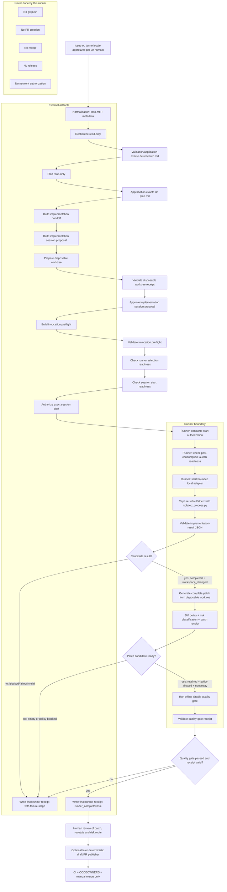

# Tutoriel du workflow agentique supervise

Ce guide explique le parcours local actuel pour transformer une tache
approuvee en patch verifie, sans publication automatique. Il decrit le flux
conceptuel, les artefacts produits et le role du runner local supervise
`.agent/checks/run_supervised_implementation.py`.

Le vocabulaire est volontairement strict:

- `ready=true` signifie qu'une precondition locale est coherente.
- `valid=true` signifie qu'un artefact correspond aux octets et politiques
  attendus.
- `authorized=true` n'est presque jamais produit par ces scripts; les scripts
  locaux conservent les champs d'autorisation a `false`.
- Un patch valide, une quality gate passee ou un receipt final ne publient
  rien, ne creent pas de PR, ne mergent rien et n'approuvent pas le contenu.

## Vue d'ensemble

Le workflow separe trois familles d'actions:

1. Les phases read-only ou de preparation construisent une tache compacte, une
   recherche, un plan, une proposition de session, un preflight et un worktree
   jetable.
2. Une autorisation locale explicite enregistre le consentement pour une
   session exacte, puis un marqueur local la consomme une seule fois dans le
   cas ordinaire.
3. Le runner local supervise lance un adaptateur borne, capture sa sortie,
   valide le resultat, genere un patch, execute la quality gate et produit un
   receipt final.

Le flux reste supervise: un humain choisit la tache, relit les artefacts a
fort levier, approuve les transitions exactes et decide quoi faire du patch
final.

## Diagramme complet



## Artefacts principaux

| Artefact | Producteur | Role | Ce que cela ne prouve pas |
| --- | --- | --- | --- |
| `task.md` | initialisation de run portable | Spec compacte approuvee | Authentification GitHub ou autorisation d'etape |
| `research.md` | phase read-only | Faits utiles pour le plan | Verite absolue, approbation du plan |
| `plan.md` | phase read-only puis approbation | Plan exact a implementer | Autorisation de demarrer un agent |
| `implementation-session-proposal.json` | proposition de session | Capacites et budgets prevus | Invocation, sandbox reel, mutation |
| `disposable-worktree-receipt.json` | preparation worktree | Worktree externe exact au commit de base | Autorisation d'utiliser le workspace |
| `implementation-invocation-preflight.json` | preflight | Paquet de preuves avant lancement | Runner selectionne ou session demarree |
| `session-start-authorization.json` | autorisation explicite | Consentement local pour une session exacte | Authentification forte, replay global |
| `session-start-authorization.json.consumed.json` | consommation locale | Rejet du replay local ordinaire | Couplage atomique au process |
| `expected-session.json` | runner supervise | Identite attendue du resultat agent | Qualite du code |
| `result.json` | adaptateur borne | Sortie JSON canonique de l'implementation | Patch valide |
| `patch.diff` | validation patch | Diff complet du worktree jetable | Approbation ou publication |
| `patch-validation.json` | validation patch | Politique, faits, risque, candidacy | Quality gate passee |
| `quality-gate.json` | quality gate | Resultats bornes Gradle | Approbation humaine |
| `final-receipt.json` | runner supervise | Resume final du parcours execute | Merge, PR, publication |
| `final-receipt-validation.json` | validateur de receipt final | Validation d'etat courant du receipt final et de ses artefacts | Authentification historique du producteur |
| `cleanup-receipt.json` | runner supervise via cleanup worktree | Nettoyage optionnel apres succes ou arret controle | Cleanup apres terminaison forcee, crash hote ou preuve de lifecycle global |

## Preparation avant le runner

Le runner local supervise ne fabrique pas toute la chaine depuis zero. Il part
d'une session deja preparee, preflighted et autorisee. Avant de l'appeler, il
faut disposer au minimum de ces entrees:

```text
<source-checkout>
<external-run>/implementation-session-proposal.json
<external-run>/disposable-worktree-receipt.json
<prepared-external-worktree>
<external-run>/implementation-session-approval.json
<external-run>/implementation-invocation-preflight.json
<external-run>/session-start-authorization.json
<expected SHA-256 values for each input>
<external-output-directory>
<external-gradle-user-home>
```

La preparation suit cette logique:

1. Construire et valider les artefacts read-only: `task.md`, `research.md`,
   `plan.md`.
2. Approuver exactement le plan requis pour la route de risque.
3. Construire le handoff d'implementation.
4. Construire une proposition de session supervisee.
5. Preparer un worktree jetable externe avec
   `.agent/checks/prepare_disposable_worktree.py`.
6. Valider le receipt du worktree.
7. Approuver exactement la proposition de session.
8. Construire et valider le preflight d'invocation.
9. Verifier la readiness de selection runner et de session-start.
10. Enregistrer l'autorisation locale exacte avec
    `.agent/checks/authorize_implementation_session_start.py`.

Ces etapes restent des preuves et des refus possibles. Elles ne lancent pas
l'adaptateur.

## Lancer le runner supervise

Le chemin le plus court depuis des artefacts deja prepares est maintenant une
commande unique. Par defaut elle reste en dry-run: elle valide les entrees,
construit l'invocation exacte et affiche la commande runner sans consommer
l'autorisation ni lancer l'adaptateur.

```text
python .agent/checks/run_agentic_workflow.py \
  --repo <clean-source-checkout> \
  --proposal <external-run>/implementation-session-proposal.json \
  --workspace <prepared-external-worktree> \
  --worktree-receipt <external-run>/disposable-worktree-receipt.json \
  --approval-receipt <external-run>/implementation-session-approval.json \
  --preflight <external-run>/implementation-invocation-preflight.json \
  --authorization-receipt <external-run>/session-start-authorization.json \
  --output-dir <external-output-directory> \
  --gradle-user-home <external-gradle-cache> \
  --format json \
  -- <adapter-command> <adapter-args>
```

Ajouter `--execute` a cette meme commande demarre le runner supervise avec la
commande construite. Ce flag ne fabrique pas d'autorisation: le receipt exact
`session-start-authorization.json` doit deja exister, etre coherent et rester
consommable. Le launcher conserve les champs d'autorisation a `false`, capture
seulement les tailles et SHA-256 de stdout/stderr du process runner, et laisse
le verdict detaille dans `final-receipt.json`.

Pour inspecter l'invocation sans passer par le launcher, il reste possible de
construire uniquement la commande exacte depuis les artefacts deja prepares:

```text
python .agent/checks/build_supervised_runner_invocation.py \
  --repo <clean-source-checkout> \
  --proposal <external-run>/implementation-session-proposal.json \
  --workspace <prepared-external-worktree> \
  --worktree-receipt <external-run>/disposable-worktree-receipt.json \
  --approval-receipt <external-run>/implementation-session-approval.json \
  --preflight <external-run>/implementation-invocation-preflight.json \
  --authorization-receipt <external-run>/session-start-authorization.json \
  --output-dir <external-output-directory> \
  --gradle-user-home <external-gradle-cache> \
  --format json \
  -- <adapter-command> <adapter-args>
```

Ce builder valide le receipt du worktree jetable, verifie que les sorties du
runner sont externes et absentes, calcule les SHA-256 courants des artefacts
d'entree, puis rend la commande exacte a executer. Il ne selectionne pas de
runner, ne consomme pas l'autorisation et ne lance pas l'adaptateur.

Le runner refuse maintenant les entrypoints d'adaptateur qui ne correspondent
pas a un fichier allowliste sous `.agent/adapters/` dans le checkout source ou
le checkout d'outillage courant. Les interpreteurs `python`/`bash` sont
autorises seulement pour lancer ces entrypoints connus ; ils ne transforment
pas une commande arbitraire en adaptateur valide. Apres validation, le runner
remplace l'entrypoint par son chemin absolu resolu avant de le transmettre au
launcher ; une commande relative ne peut donc pas designer un fichier different
dans le worktree jetable au moment de l'execution.

Un adaptateur local generique est fourni pour les CLI d'agents:

```text
python .agent/adapters/local_implementation_adapter.py \
  --expected-session <external-run>/expected-session.json \
  --workspace <prepared-external-worktree> \
  -- <agent-command> <agent-args>
```

L'adaptateur execute la commande dans le worktree, capture sa sortie sans la
recopier dans le protocole, detecte si le workspace a change, puis emet le
JSON canonique attendu par le runner. Il ne genere pas de patch, ne lance pas
Gradle et ne publie rien. Par exemple, une commande Codex peut etre placee
derriere `--` lorsque l'environnement local fournit deja l'authentification et
les limites de cout attendues. L'adaptateur local refuse les commandes dont le
basename n'est pas dans sa policy, sauf commandes Python explicitement reservees
aux fixtures `local-adapter-fixture`.

Le runner actuel est:

```text
python .agent/checks/run_supervised_implementation.py ...
```

Sa forme generale est:

```text
python .agent/checks/run_supervised_implementation.py \
  --repo <clean-source-checkout> \
  --proposal <external-run>/implementation-session-proposal.json \
  --proposal-sha256 <sha256> \
  --workspace <prepared-external-worktree> \
  --worktree-receipt <external-run>/disposable-worktree-receipt.json \
  --worktree-receipt-sha256 <sha256> \
  --approval-receipt <external-run>/implementation-session-approval.json \
  --approval-receipt-sha256 <sha256> \
  --preflight <external-run>/implementation-invocation-preflight.json \
  --preflight-sha256 <sha256> \
  --authorization-receipt <external-run>/session-start-authorization.json \
  --authorization-receipt-sha256 <sha256> \
  --expected-session-output <external-run>/expected-session.json \
  --result-output <external-run>/result.json \
  --patch-output <external-run>/patch.diff \
  --patch-receipt-output <external-run>/patch-validation.json \
  --quality-gate-receipt-output <external-run>/quality-gate.json \
  --final-receipt-output <external-run>/final-receipt.json \
  --cleanup-receipt-output <external-run>/cleanup-receipt.json \
  --gradle-user-home <external-gradle-cache> \
  --format json \
  -- <adapter-command> <adapter-args>
```

Important: tous les outputs doivent etre absents avant le run, distincts, en
dehors du checkout source et en dehors du worktree jetable.

`--cleanup-receipt-output` est optionnel. Lorsqu'il est fourni, le runner peut
appeler le cleanup exact du worktree jetable apres un succes complet ou apres
un arret controle survenu apres consommation/launch readiness. Le receipt de
cleanup est ensuite valide par
`.agent/checks/validate_disposable_worktree_cleanup.py`, puis retenu dans
`final-receipt.json`. Cette frontiere ne prouve pas le cleanup apres
terminaison forcee, crash hote, ni un lifecycle global automatique.

## Ce que fait le runner, pas a pas

### 1. Consommer l'autorisation

Le runner appelle la consommation de l'autorisation de session-start. Cela
ecrit un marqueur adjacent:

```text
session-start-authorization.json.consumed.json
```

Si le marqueur existe deja, le run s'arrete. Cette protection rejette le replay
local ordinaire, mais elle n'est pas un registre global, une signature ou une
protection cross-host.

### 2. Revalider la launch readiness

Le runner recontrole que:

- le preflight reste valide;
- la readiness d'invocation reste coherente;
- le marqueur de consommation est valide;
- les preuves courantes correspondent toujours aux octets attendus.

`launch_ready=true` permet de continuer dans ce runner, mais ne prouve pas une
isolation reseau ni un couplage atomique entre consommation et lancement.

### 3. Lancer l'adaptateur borne

Le runner lance l'adaptateur via `.agent/checks/isolated_process.py`.

Le launcher:

- n'utilise pas de shell;
- ferme `stdin`;
- reconstruit l'environnement enfant depuis une allowlist;
- borne le temps;
- capture `stdout` et `stderr` avec une limite d'octets.

L'adaptateur doit ecrire sur `stdout` un unique JSON canonique suivi d'un
retour ligne. Ce JSON doit suivre le schema
`.agent/schemas/implementation-result.schema.json`.

### 4. Valider le resultat d'implementation

Le runner passe la capture reelle a
`.agent/checks/validate_implementation_result.py`.

Un resultat candidat doit notamment:

- avoir `status="completed"`;
- declarer `workspace_changed=true`;
- garder `patch_generated=false`;
- garder `deterministic_checks_run=false`;
- garder `publication_requested=false`;
- garder `network_requested=false`;
- correspondre exactement a `expected-session.json`.

Si le resultat est `blocked`, `failed`, invalide ou sans changement de
workspace, le runner ecrit quand meme un `final-receipt.json`, mais ne genere
pas de patch candidat.

### 5. Generer et valider le patch

Si le resultat est candidat, le runner appelle
`.agent/checks/validate_implementation_patch.py`.

Cette etape:

- regenere le patch complet depuis le worktree jetable;
- verifie que le patch represente tout l'etat du worktree;
- applique la diff policy;
- classifie le risque;
- ecrit `patch.diff` et `patch-validation.json`.

Un patch n'est candidat pour la quality gate que s'il est non vide, retenu et
autorise par la diff policy.

### 6. Executer la quality gate

Si le patch est candidat, le runner appelle
`.agent/checks/run_implementation_quality_gate.py`.

La quality gate execute exactement:

```text
gradlew.bat ktlintCheck detekt --offline --no-daemon --console=plain
gradlew.bat test --offline --no-daemon --console=plain
gradlew.bat verifyPlugin --offline --no-daemon --console=plain
```

Elle ecrit un receipt borne, sans logs bruts complets. Le runner valide ensuite
ce receipt avec `.agent/checks/validate_implementation_quality_gate.py`.

Une quality gate passee reste une evidence de verification locale. Elle ne
remplace pas la review humaine.

### 7. Nettoyer optionnellement le worktree

Si `--cleanup-receipt-output` est fourni et que le runner atteint un patch
candidat avec quality gate passee et receipt valide, il appelle
`.agent/checks/cleanup_disposable_worktree.py` avec confirmation exacte du
chemin canonique du workspace. Le cleanup receipt est valide, ajoute aux
artefacts du receipt final, `cleanup_receipt_valid=true` et
`cleanup_required=false`.

Avec le meme output optionnel, le runner tente aussi ce cleanup lors des arrets
controles apres consommation et readiness de lancement, par exemple resultat
d'implementation invalide, resultat non candidat, patch non candidat, quality
gate echouee ou receipt de quality gate invalide. Le cleanup receipt est
valide dans ces chemins aussi. Une fixture de preuve observe egalement le cas
ou le launcher renvoie un timeout d'adaptateur deja capture: le runner bloque
avant retention de `result.json`, avant generation du patch et avant quality
gate, puis tente le cleanup optionnel. Le runner ne prouve toujours pas le
cleanup apres terminaison forcee de processus hors chemin capture, timeout non
controle ou crash hote.

### 8. Produire et valider le receipt final

Le runner ecrit toujours `final-receipt.json` pour les arrets controles. Ce
receipt indique notamment:

- `runner_complete`;
- le `stage` final;
- l'identite de session;
- les artefacts produits et leurs SHA-256;
- les echecs eventuels;
- `quality_gate_passed`;
- `quality_gate_receipt_valid`;
- `cleanup_receipt_valid`;
- les champs d'autorisation du contrat final conserves a `false`:
  `authorized`, `publication_authorized`, `network_authorized` et
  `merge_authorized`.

Apres l'ecriture, le runner valide aussi ce receipt avec
`.agent/checks/validate_supervised_runner_receipt.py`. Cette validation verifie
les octets du receipt, son schema, les bindings actuels et les artefacts encore
presents aux chemins declares. Elle ne signe pas le receipt, n'authentifie pas
le producteur et ne prouve pas l'historique du run.

## Lire le resultat

Un run complet et favorable ressemble a ceci:

```text
runner_complete=true
stage=complete
authorization_consumed=true
launch_ready=true
adapter_executed=true
implementation_result_valid=true
implementation_candidate_ready=true
patch_candidate_ready=true
quality_gate_passed=true
quality_gate_receipt_valid=true
publication_authorized=false
merge_authorized=false
```

Un run bloque est aussi utile. Exemples:

| Stage | Cause typique | Suite humaine |
| --- | --- | --- |
| `authorization_consumption` | receipt deja consomme ou invalide | relire la chaine d'autorisation |
| `launch_readiness` | preflight, marker ou readiness incoherent | reconstruire les preuves exactes |
| `implementation_result` | JSON invalide, blocked, failed, pas de changement | lire le resume agent et ajuster la tache |
| `implementation_patch` | patch vide ou bloque par policy | review humaine route C ou correction du plan |
| `quality_gate` | Gradle echoue | corriger dans un nouveau cycle |
| `quality_gate_validation` | receipt incoherent | rejeter l'evidence et relancer proprement |

## Exemple mental simple

Imagine une petite correction documentaire:

1. L'humain approuve une tache.
2. Les artefacts `task`, `research` et `plan` sont produits puis approuves.
3. Un worktree jetable est cree a partir du commit de base.
4. La session d'implementation est proposee, approuvee, preflighted et
   autorisee.
5. Le runner consomme l'autorisation.
6. L'adaptateur modifie le fichier dans le worktree jetable et renvoie un
   `implementation-result` canonique.
7. Le runner genere `patch.diff`.
8. La diff policy autorise le patch.
9. La quality gate passe.
10. Le runner ecrit `final-receipt.json`.
11. Un humain relit le patch et les receipts.
12. Le publisher local de PR brouillon peut etre utilise plus tard en dry-run
    par defaut, puis avec `--execute` seulement sur demande humaine explicite.
    Il reste un composant determinant separe du runner.

## Commandes de controle utiles

Verifier l'etat global du pilote:

```text
python .agent/checks/check_workflow_status.py --repo . --format json
```

Verifier les controles runner actuels:

```text
python .agent/checks/assess_runner_readiness.py --repo . --format json
```

Valider un receipt final de runner:

```text
python .agent/checks/validate_supervised_runner_receipt.py \
  --receipt <external-run>/final-receipt.json \
  --receipt-sha256 <sha256> \
  --format json
```

Generer un patch complet du checkout courant:

```text
python .agent/checks/generate_complete_patch.py \
  --repo . \
  --base <base-commit> \
  --output <external-path>/patch.diff \
  --format json
```

Valider et classifier un patch:

```text
python .agent/checks/diff_policy.py \
  --patch <external-path>/patch.diff \
  --repo . \
  --base <base-commit> \
  --format json

python .agent/checks/classify_patch_risk.py \
  --patch <external-path>/patch.diff \
  --repo . \
  --base <base-commit> \
  --format json
```

Quality gate repository classique:

```text
.\gradlew.bat ktlintCheck detekt
.\gradlew.bat test
.\gradlew.bat verifyPlugin
```

## Ce qui reste volontairement hors scope

Le workflow local actuel ne prouve pas encore les controles que
`assess_runner_readiness.py` expose encore comme `related_evidence_only`:

- l'authentification forte de l'approbateur;
- la prevention de replay cross-host;
- la non-propagation des credentials fournisseur aux descendants lances par un
  vrai agent, au-dela du filtrage d'environnement direct;
- le cycle de vie complet du worktree jetable apres terminaison forcee, timeout
  non controle, crash hote ou mutation concurrente;
- le blocage filesystem des ecritures absolues arbitraires par un processus
  enfant;
- le timeout complet de session, l'arbre de processus arbitraire et le cleanup
  apres timeout hors chemin capture;
- l'enforcement reel du budget de tours modele;
- l'isolation reseau au niveau OS, sandbox ou provider;
- le couplage atomique crash-safe entre consommation d'autorisation et process;
- l'authentification historique d'une vraie execution Gradle quality gate;
- la selection d'un golden set historique authentifie;
- la comparaison multi-adapter avec metriques fiables;
- l'approbation de merge ou de release.

La publication deterministe de PR brouillon existe comme outillage local separe
et reste en dry-run par defaut. Son execution avec effet externe demande une
instruction humaine explicite; elle n'est jamais autorisee par le runner, le
receipt final ou `pilot_ready=true`.

Ces limites ne sont pas des echecs du runner. Elles evitent de confondre un
prototype local supervise avec une plateforme autonome de publication.
